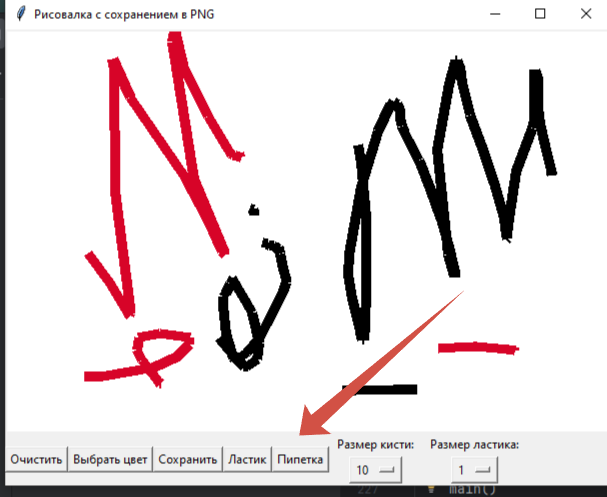
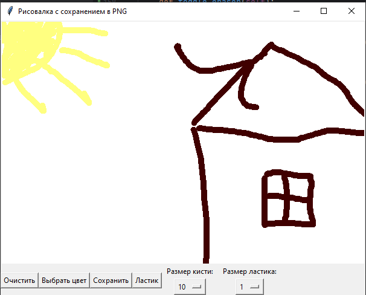

# Программа для создания изображений на основе TKinter
## В разработке...

Данная программа представляет собой пример использования библиотеки TKinter для создания графического интерфейса.

• Добавлена документация функций.  
• Добавлено меню для выбора размера кисти.  
• Добавлен инструмент `Ластик`.  
• Добавлен инструмент `Кисть`.  
• Надписи на кнопках заменены на иконки.  
• Добавлена возможность загрузки изображения из файла.  
• Добавлен инструмент в виде пипетки для выбора цвета.  
• Добавлены функциональные горячие клавиши быстрого действия Ctrl-C и Ctrl-S.  
• **(NEW)** Добавлена возможность изменения цвета фона. 
• **(NEW)** Поменял значки управления. 
• **(NEW)** Добавление параметра для предварительного просмотра цвета кисти. 

Поменял значки (Последняя версия)

Добавление параметра для предварительного просмотра цвета кисти
